<p align="center">
  
</p>

<h1 align="center">沉思 · Chensi</h1>
<p align="center"><strong>A quiet place to write to yourself.</strong><br>
Quick capture for fleeting thoughts · a star map where <em>position is visibility</em> · a community with no comment section.</p>

<p align="center">
  <a href="https://chensi.app"><strong>chensi.app</strong></a> · live since July 2026 · bilingual 中 / EN · light & dark · PWA<br>
  Next.js 16 · React 19 · TypeScript · Tailwind CSS 4 · Supabase (Postgres + RLS) · Vercel
</p>

The product itself is closed-source. This repository is its public face: what it looks like, why it is designed the way it is, how it is engineered, and two self-contained **craft slices** lifted straight out of it that you can run and read.

> **中文读者**：沉思是一个「写给自己」的慢社交小工具——闪念先落在只有自己看得见的收件箱，想清楚了再升格成 thread，别人只能写一条完整的「回应」，最后由作者亲手写结语完结。产品本体闭源；这个仓库是它的公开门面：产品长什么样、为什么这样设计、底下的工程是怎么做的，外加两个可以直接运行的工艺切片。

---

## The loop

Chensi is built around one path, from a fleeting thought to a settled one:

1. **Capture.** A thought flashes by — jot it down (typing or bilingual dictation). It lands in an inbox only you can see.
2. **Drift.** Each note becomes a star on your **idea star map**. Where a star sits *is* its visibility: drag it into *Only me*, *Friends*, or *Open plaza* and the database changes with it.
3. **Shape.** When you have thought it through — or want company thinking — promote a note into a thread: answer yourself, or open it to the community.
4. **Respond.** There is no comment section. Others may write one considered *response* each, standing alone as its own piece. The author stamps the ones that carried weight in cinnabar.
5. **Close.** In the end the author writes the closing words and closes the thread by hand. It is a ritual, not something the system does for you.

---

## Product tour

### Landing — 中 / EN

The first visit is served in the reader's language (see [i18n](#internationalization--theming)); the toggle is one tap away in the nav.

<table>
  <tr>
    <td width="50%">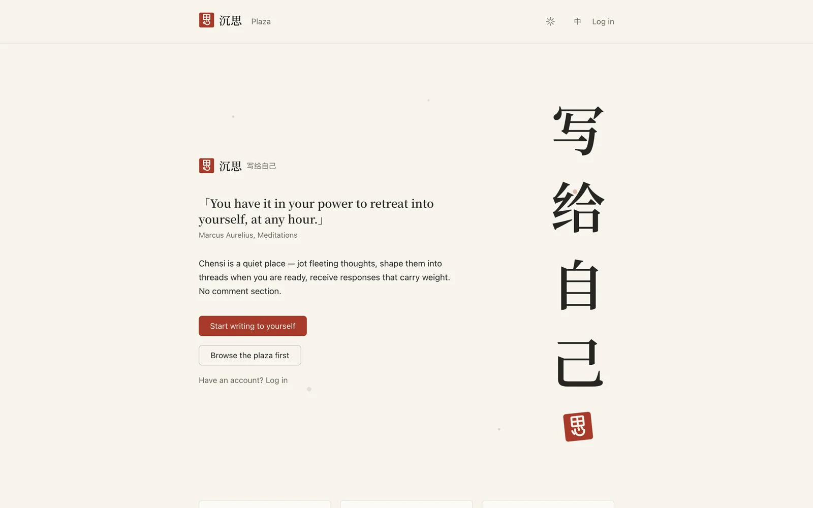</td>
    <td width="50%">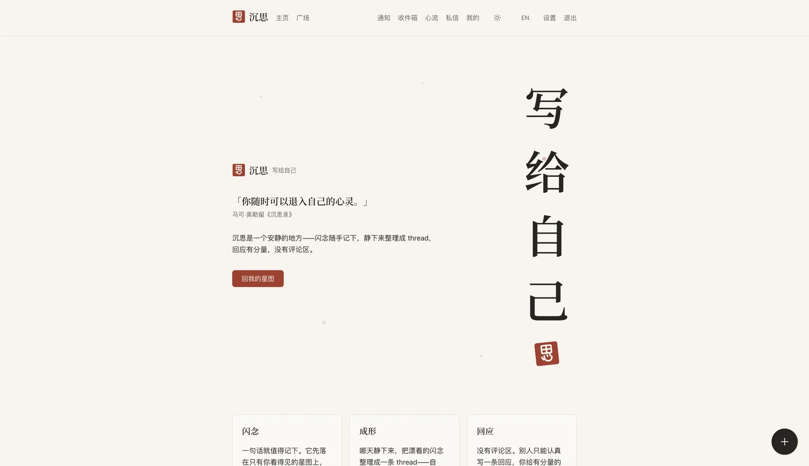</td>
  </tr>
</table>

### Capture

One line is worth keeping. The capture surface is also reachable as a modal over any page (Next.js parallel + intercepting routes), so the thought never has to wait for a navigation.

<p align="center">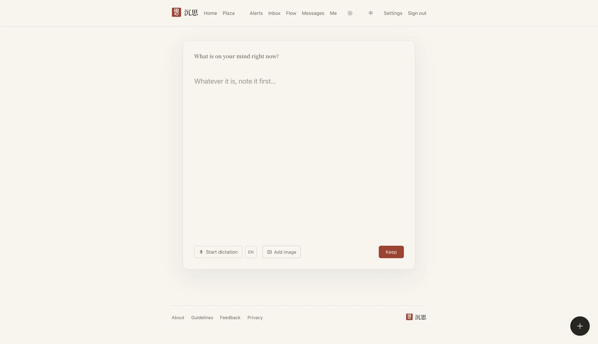</p>

### The idea star map

Your notes and threads as a night sky. Raw notes drift pale in the middle; shaped threads set as ink; public ones carry a cinnabar seal; the lines are connections you drew yourself. The three **ink pools** at the edges are the visibility model made physical.

<table>
  <tr>
    <td width="50%"></td>
    <td width="50%">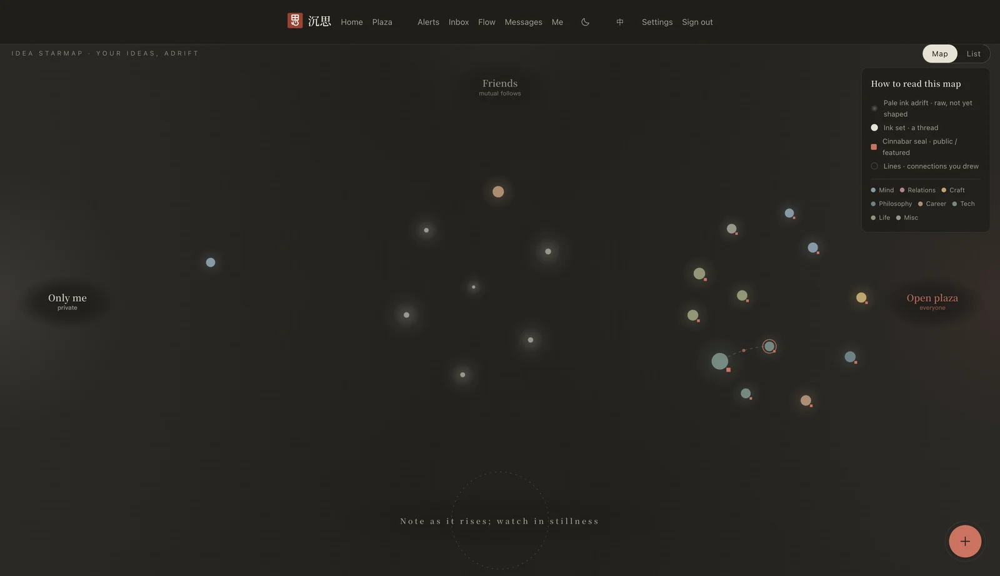</td>
  </tr>
  <tr>
    <td colspan="2">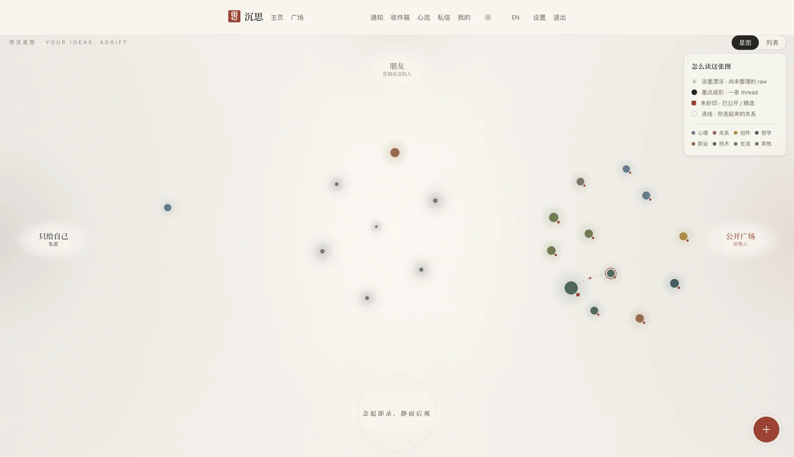</td>
  </tr>
</table>

### Plaza — other people's ink

The plaza is a sky of everyone's public threads: tap a dot to read, or switch to a searchable list. Ranking uses only your own traces — never other people's behaviour.

<table>
  <tr>
    <td width="50%">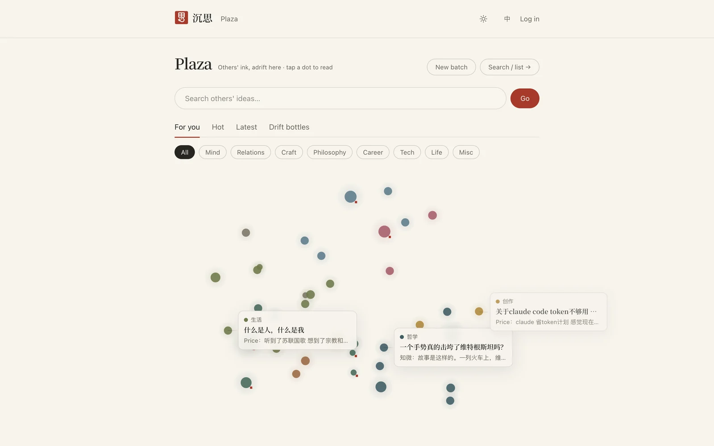</td>
    <td width="50%">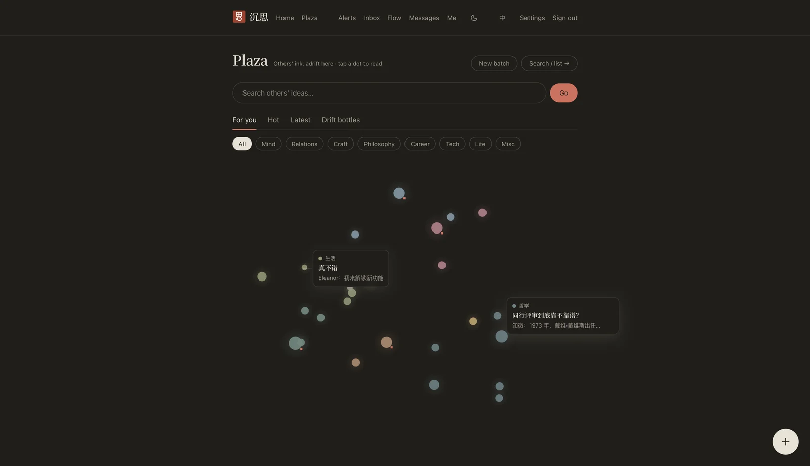</td>
  </tr>
</table>

### A thread, from responses to closing words

Responses only — one per person, each its own piece. The author marks the ones that mattered (*Deeply valuable / Gave me an angle / A view of its own*); counts are public, identities are not. The closing words sit in a cinnabar frame at the top: the thread is done.

<p align="center">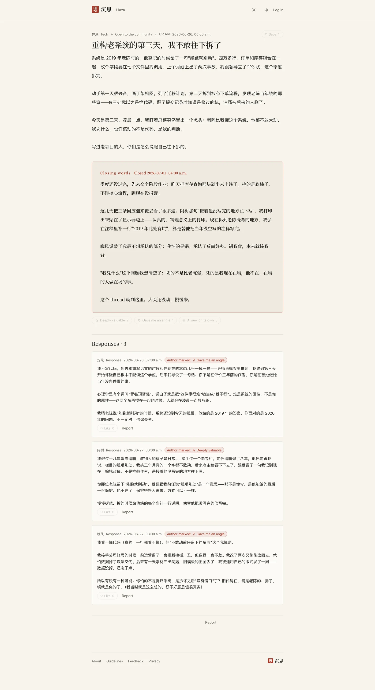</p>

<table>
  <tr>
    <td width="50%">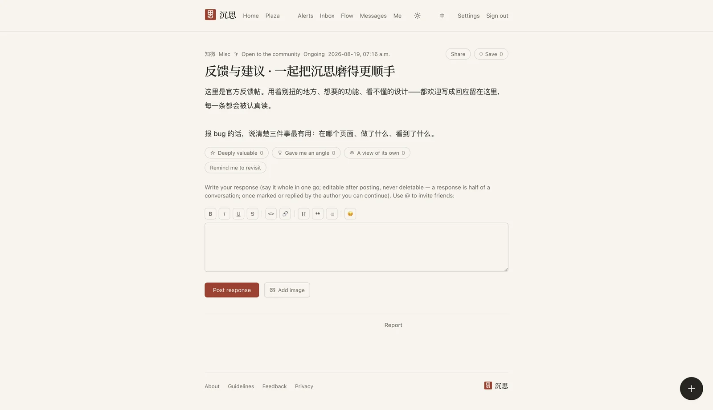</td>
    <td width="50%">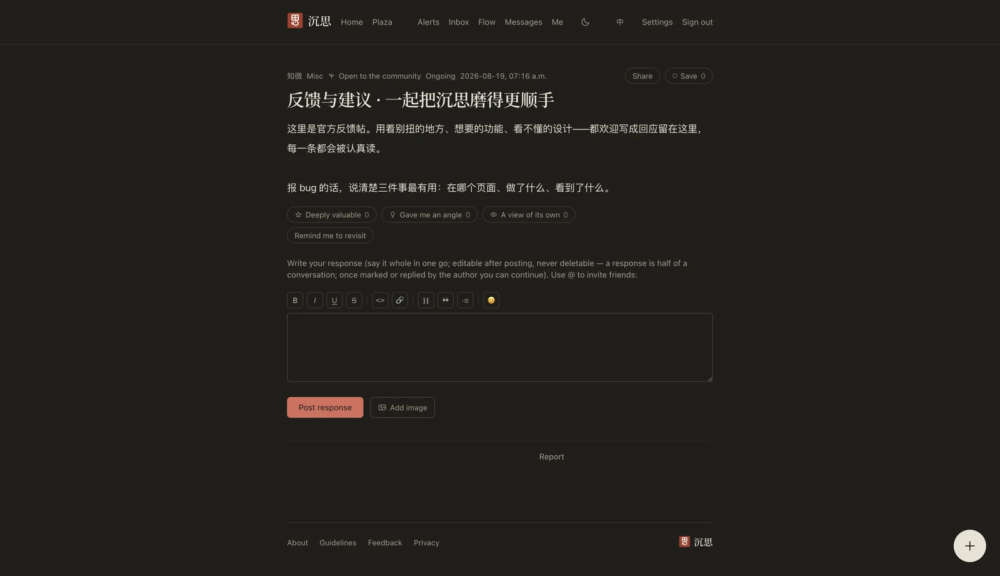</td>
  </tr>
</table>

### Phone

Same product, one column. Layout and the star map both adapt; the capture button stays under the thumb.

<table>
  <tr>
    <td width="33%">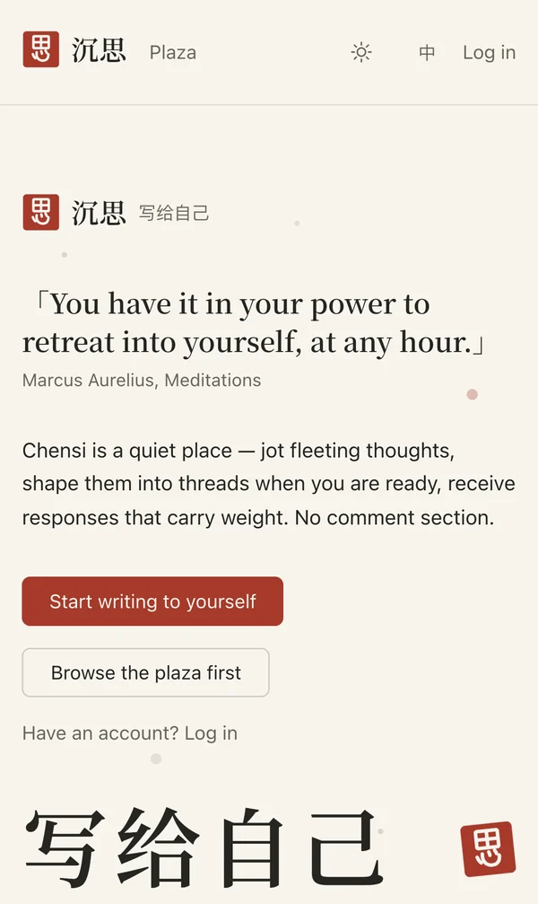</td>
    <td width="33%">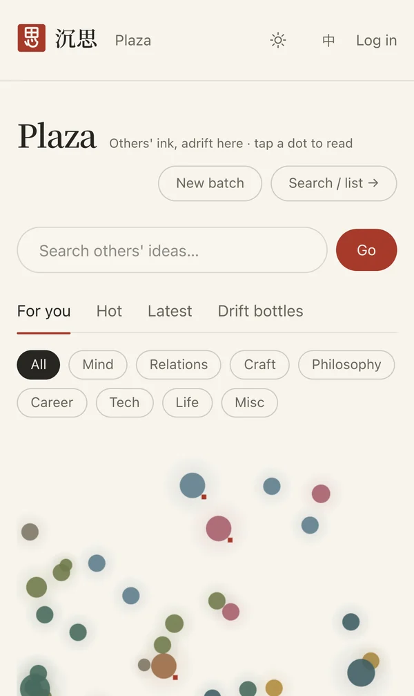</td>
    <td width="33%">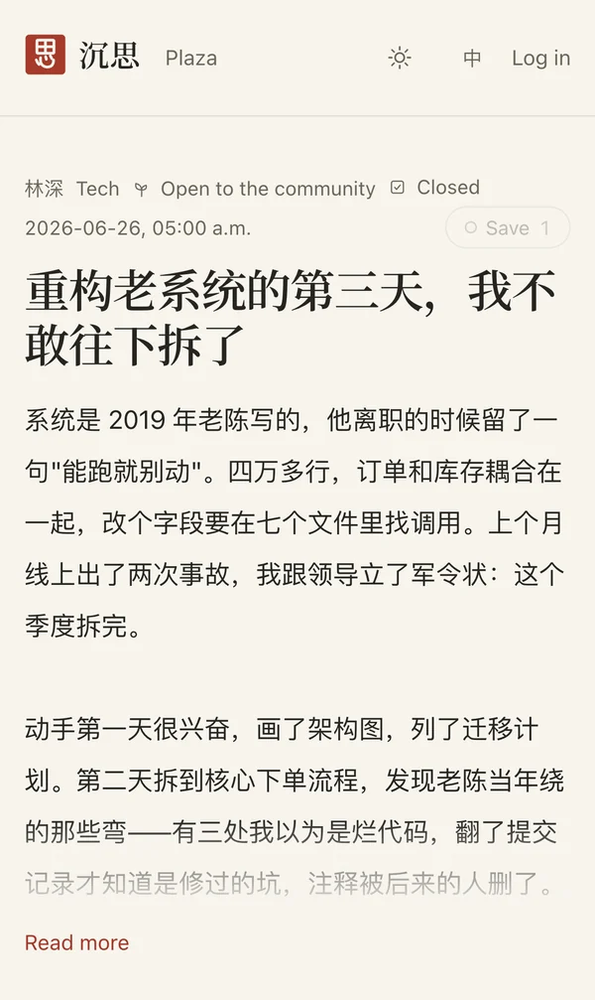</td>
  </tr>
  <tr>
    <td width="33%">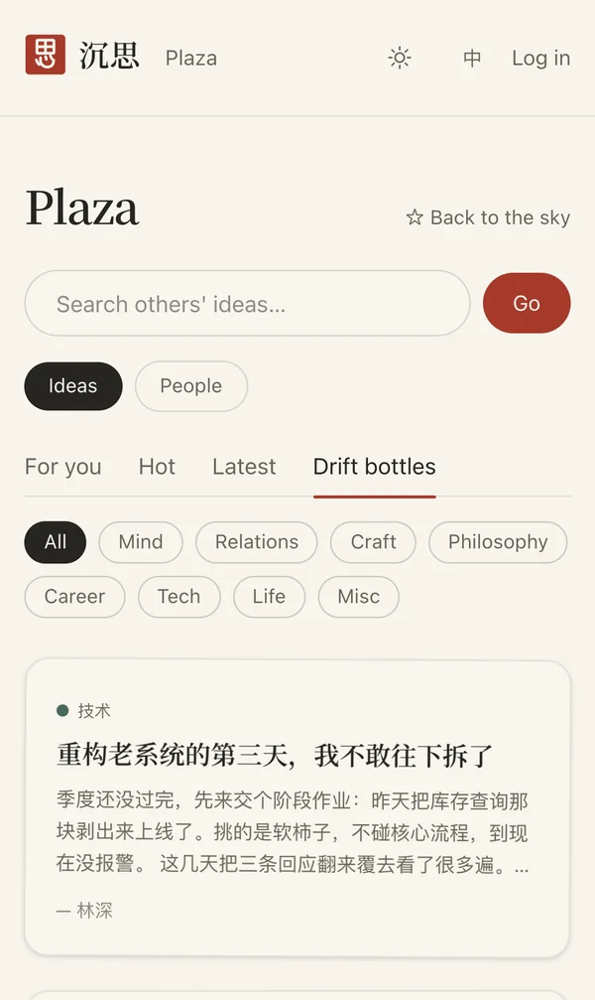</td>
    <td width="33%">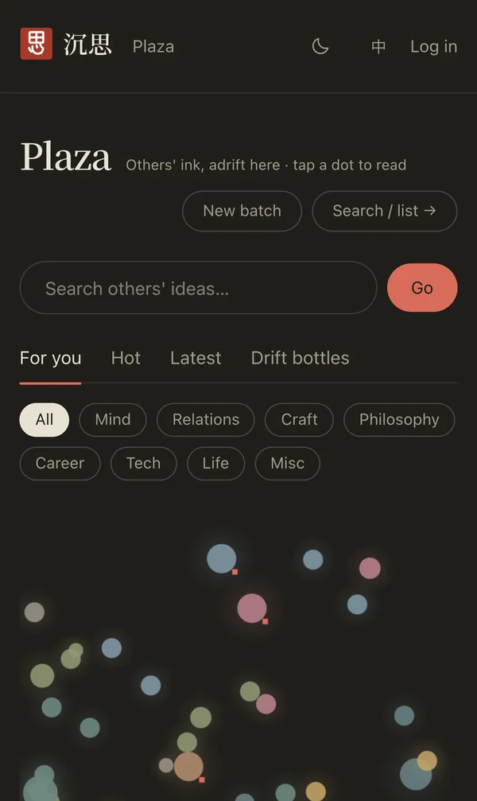</td>
    <td width="33%"></td>
  </tr>
</table>

---

## Design decisions

**No comment section.** Comment sections teach everyone to snatch the mic. A thought one person has worked through deserves another person writing a full, considered response — so there are responses, one per person per thread, and nothing else. No follows-as-status, no follower counts, no trending.

**Position is visibility.** Instead of a dropdown, the star map has three ink pools. Dragging a star into *Friends* is a real write to the database, guarded by an in-app confirmation that can be turned off per device. The metaphor and the data model are the same thing.

**Three stamps are the only public reactions on a thread.** Readers can stamp a thread; authors can stamp a response. Counts are public, who stamped is private. There is no downvote, no like leaderboard, no trending.

**Closing is a ritual.** A thread ends when the author writes closing words. The system never closes one for you.

**Paper, ink, cinnabar, quiet.** Five colour tokens (paper `#F7F4ED`, ink `#262521`, cinnabar `#A63A2B` and two softer companions), a serif reserved for titles and seals, a spacing whitelist, three border opacities, five motion tokens. Every UI rule is written down in one *art system* document that is the tiebreaker for all interface work — including the canvas, which reads the same CSS variables as the DOM.

---

## Architecture

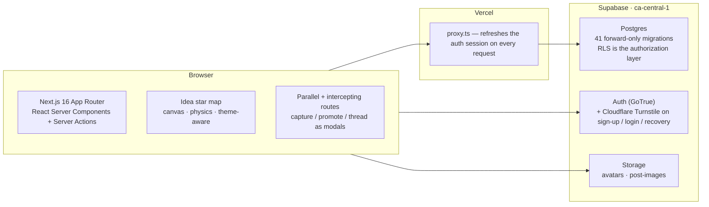

| Layer | Choice | Why |
|---|---|---|
| Framework | **Next.js 16** App Router, React 19, TypeScript 5 | Server Components keep the data path on the server; **Server Actions** (17 modules: notes, threads, posts, reactions, links, social, messages, moods, reminders, annotations, account, …) handle all app-data writes; the browser never writes app tables directly — Row Level Security, not the UI, is the security boundary |
| Modals | Parallel route `@modal` + intercepting routes | Capture, promote-to-thread and thread detail open *over* the current page on client navigation and still work as full pages on a hard load |
| Styling | Tailwind CSS 4 with a token-only palette | The art system is enforceable: components may only use tokens, so light/dark is a variable swap |
| Data | **Supabase Postgres** with Row Level Security | Authorization lives next to the data, not in application code that could be bypassed |
| Auth | Supabase Auth + **Cloudflare Turnstile** | Captcha enforced at the auth server, not just the form; free tier, no metered API |
| Files | Supabase Storage buckets `avatars` (cropped to 256×256 in the browser before upload) and `post-images` | Size and MIME limits set on the bucket |
| Hosting | Vercel (Git-integrated) | Every `main` merge is a production deploy |
| PWA | Web manifest + service worker + hand-drawn seal icon | Installable on a phone home screen |

### The star map, technically

A single canvas. Each star's motion is three rules layered — per-star drift (own phase and frequency, so nothing is in sync), a very weak pull back to its anchor, and a soft repulsion from neighbours — under damping, so it behaves like water rather than space. Positions are seeded from a hash of the item id, so your stars are where you left them after every refresh. Size encodes how much sits beneath a thread (its folded subtree, log-compressed); glow encodes how many people responded. You can draw links between threads, fold a subtree into its parent (it is drawn being *absorbed*), zoom with names fading in, and archive into the **inner world** through the gate at the bottom. `prefers-reduced-motion` is respected throughout. The bare physics is extracted in [`starmap-physics/`](./starmap-physics) as a zero-dependency HTML file.

---

## Data model & security

The visibility model is two orthogonal columns, and the three ink pools map onto them exactly:

| On the map | `is_private` | `audience_friends` | Who can read |
|---|---|---|---|
| Open plaza | `false` | — | everyone |
| Friends | `true` | `true` | mutual follows |
| Only me | `true` | `false` | the author |

A separate `mode` (`self` / `open`) says whether a thread accepts responses at all. Opening can't be undone (people have written), but **visibility can always be pulled back** — and anyone who already responded keeps access to what they wrote. That exception is a `SECURITY DEFINER` predicate that only ever answers about the *caller* (`auth.uid()`), so it cannot be turned into an oracle for "has person X responded to thread T".

Other things the database enforces on its own:

- **Trusted timestamps.** Clients have no column grant on `created_at`; rows are stamped by the database clock. Column-level grants limit writes to the business columns.
- **Concurrency-safe rate limits.** Posting limits run inside `SECURITY DEFINER` functions that take a `FOR UPDATE` lock on the caller's profile row — two concurrent requests cannot both slip through the window.
- **Frozen reactions.** A `BEFORE UPDATE` trigger pins a reaction's identity and target columns, so a row cannot be re-pointed at another thread or response.
- **Forward-only migrations.** 41 numbered migrations; a shipped migration is never edited or "repaired". Fixes are new migrations, and every quality gate replays the full chain from an empty database first.
- **Your data is yours.** One-click export of everything; self-service account deletion that removes everything at once; zero tracking cookies.

---

## Quality gate

One command runs the whole gate locally, and CI runs the same gate against a real database:

```
npm run verify:local:reset
  toolchain preflight (node-path · supabase-version · browser-path · docker-context)
  → runner-contract → db-reset (replay all migrations + seed on an empty DB)
  → vitest (333 unit tests / 44 files) → lint → build → tsc
  → e2e (119 Playwright tests / 35 specs, real browser against the freshly reset DB)
```

- **CI is the same gate, not a lighter one.** The GitHub Actions workflow boots a local Supabase inside the runner and runs `verify:ci:reset` — the identical phases against a real database. `main` is branch-protected, with `verify` as the required status check for pull requests.
- **Toolchain contract, fail-closed.** Node `24.13.1` (`.nvmrc`), npm `11.8.0` (`packageManager`), Supabase CLI `2.109.1` as an *exact* devDependency. Preflight stops on any mismatch rather than continuing on a "probably fine" version.
- **Supply-chain boundary.** The only allowed install is `npm ci --ignore-scripts`: lifecycle scripts never run, and the lockfile pins registry URLs and integrity hashes for every package.
- **Every change ships with its tests.** 107 merged pull requests to date; the full suite is the release gate, not an afterthought.

---

## Internationalization & theming

**Language.** On a first visit the locale is decided from `Accept-Language` (q-ranked); with no usable language header it falls back to the request's country (CN / HK / MO / TW → 中文, everywhere else → English), and to 中文 only when there is no signal at all. Detection **never writes a cookie** — only an explicit toggle does (one year), and a malformed cookie self-heals back to detection. Core surfaces are fully bilingual; the dictation button follows the interface language.

**Appearance.** Three states: follow system, light, dark. An explicit choice sets `data-theme`; "system" falls through to `prefers-color-scheme` with guards so that explicit *light* still wins on a dark OS. Everything drawn on canvas — the star map, the plaza sky, the drift bottles — reads the same CSS variables the DOM uses and re-reads them on change, so nothing is hard-coded and nothing is left behind when the theme flips. Topic colours have a single source in TypeScript; their dark variants are derived by one formula.

---

## What's in this repository

Two pieces distilled from the product, small enough to read in one sitting:

| Slice | One line |
|---|---|
| [`starmap-physics/`](./starmap-physics) | The drift-and-gravity feel of the idea star map, in one double-clickable HTML file. Zero dependencies. |
| [`confirm-ink/`](./confirm-ink) | The in-app confirmation dialog that replaces the browser's black `confirm()` box: an imperative `await confirmInk(...)` API, focus trapping, a "don't ask again" protocol, and a 43-line shell-inert coordinator shared by every overlay on the site. |

Each folder has its own README with the design notes.

---

## By the numbers

| | |
|---|---|
| Live | [chensi.app](https://chensi.app) — in production since July 2026, on its own domain since August 2026 |
| Routes | 28 pages + 4 modal intercepts |
| Server-action modules | 17 |
| Database migrations | 41, forward-only |
| Tests | 333 unit (vitest) + 119 end-to-end (Playwright) — the release gate, run in full before every release |
| Merged pull requests | 107 |
| Languages | 中文 · English (full UI and dictation) |

---

## Where Chensi stands

- No comment section — others may only write one considered response.
- No recommendations driven by other people's behaviour; ranking uses only your own traces. No like leaderboards, no trending.
- Zero tracking cookies. Export everything. Delete your account yourself, instantly.

---

## License

The slices are **MIT** — use them freely. The name 沉思 / Chensi and the product itself are not covered by that license.

Thoughts? The *Feedback* link in the footer of [chensi.app](https://chensi.app) goes straight to me.
